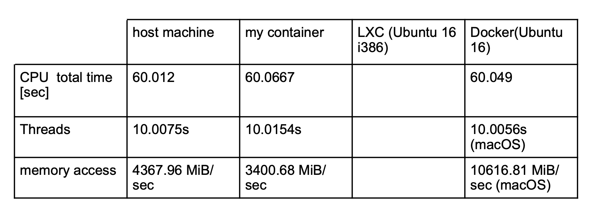
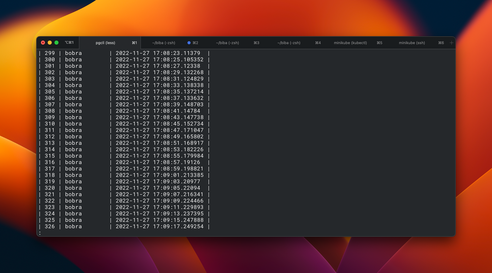

# Lab 5

[Check out repo for all files](https://github.com/glebosotov/inno-total-virtualization-rabbitmq)

## Important assumption

I have seen that tha lab task requires I write the commands I use but I assume that mentioning all of them would create too much text. I am using default commands such as (`docker build, docker compose up/down/pull/rm, docker push, kubectl apply/get/delete/describe/logs, pgcli (in general to interract with postgres), python, pip, virtual env for python, minikube start/dashboard/tunnel`). I beleive this is enough on commands.

## Task 1: Dockerfile

My Dockerfile (follows the best of practices):

```dockerfile
FROM ubuntu:18.04
```

Benchmark results:



## Task 2

### 1. Check out [`reader.py`](https://github.com/glebosotov/inno-total-virtualization-rabbitmq/blob/master/reader.py)

### 2. [Dockerfile](https://github.com/glebosotov/inno-total-virtualization-rabbitmq/blob/master/Dockerfile)

```dockerfile
FROM python:3.10
COPY reader.py /app/reader.py
COPY requirements.txt /app/requirements.txt
WORKDIR /app
RUN pip install -r requirements.txt
CMD ["python", "reader.py"]
```

### 3. Pass the arguments

I pass the arguments using the env values, since I plan to use that in docker compose.

### 4. DockerHub

[My image](https://hub.docker.com/repository/docker/glebosotov/inno-tv-rabbitmq-reader)

## Task 3

Check out [`docker-compose.yml`](https://github.com/glebosotov/inno-total-virtualization-rabbitmq/blob/master/docker-compose.yml)

Things to note:

- I am using local folder for postgres data storage (volume)
- I am using an env file to configure everything
- I have a [sql init script](https://github.com/glebosotov/inno-total-virtualization-rabbitmq/blob/master/sql/create_tables.sql) passed to docker entrypoint, it creates 2 tables
- The reader logs a message to table message1 if it contains 'bebra' and to table message2 otherwise
- The [sender](https://github.com/glebosotov/inno-total-virtualization-rabbitmq/blob/master/sender.py) sends a message to the queue every seconds iterating between 'bebra' and 'bobra'

## Task 4

### My steps

- Create a deployment for reader, sender, rabbitmq-server and postgres
- Apply the deployments
- Create load balancer for postgres so I can check the data from the outside
- Get the IP of the postgres service and rabbitmq-server service (created in the last steps)
- Paste that IP to the sender and reader yml files (as my images require that)
- Apply the changes
- Check the logs of the reader and sender
- Check the data in the postgres

### Things to note

- Postgres should use a [persistent volume](https://kubernetes.io/docs/concepts/storage/persistent-volumes/), but I assume that it is not required for this lab. I would use PersistentVolume type with local storage.

### My results

Output of `kubectl get all`:

```bash
NAME                             READY   STATUS              RESTARTS   AGE
pod/rabbit-db-5495f57485-dp7hh   1/1     Running             0          19m
pod/rabbitmq-57679f77b5-9f54x    1/1     Running             0          19m
pod/reader-847898dbf9-j5896      0/1     ContainerCreating   0          3s
pod/reader-847898dbf9-k9dlt      0/1     ContainerCreating   0          3s
pod/reader-847898dbf9-qfwsh      1/1     Running             0          77s
pod/sender-7846997dcf-vmg6z      1/1     Running             0          3m13s

NAME                      TYPE           CLUSTER-IP      EXTERNAL-IP   PORT(S)          AGE
service/kubernetes        ClusterIP      10.96.0.1       <none>        443/TCP          28d
service/rabbit-database   LoadBalancer   10.100.0.239    127.0.0.1     5432:32181/TCP   16m
service/rabbit-server     LoadBalancer   10.102.201.79   127.0.0.1     5672:30418/TCP   16m

NAME                        READY   UP-TO-DATE   AVAILABLE   AGE
deployment.apps/rabbit-db   1/1     1            1           19m
deployment.apps/rabbitmq    1/1     1            1           19m
deployment.apps/reader      1/3     3            1           2m5s
deployment.apps/sender      1/1     1            1           7m46s

NAME                                   DESIRED   CURRENT   READY   AGE
replicaset.apps/rabbit-db-5495f57485   1         1         1       19m
replicaset.apps/rabbitmq-57679f77b5    1         1         1       19m
replicaset.apps/reader-74b58f6c46      0         0         0       2m5s
replicaset.apps/reader-847898dbf9      3         3         1       77s
replicaset.apps/sender-5df4545d57      0         0         0       4m50s
replicaset.apps/sender-7846997dcf      1         1         1       3m13s
replicaset.apps/sender-84475ddf55      0         0         0       7m46s
```

Data in postgres (accessed locally):


